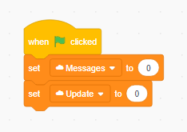

## Goal of the project

The goal of this project is to create a Scratch project that connects to a self-hosted or remote server in order to update the unread message count of your Scratch account.  To do this, you need a **computer** or **Raspberry Pi**, a **[Scratch account](https://scratch.mit.edu/join)** that is not a New Scratcher, **[Node.js](nodejs.org)**, and **[NPM](https://docs.npmjs.com/cli/v6/configuring-npm/install)**.

## Setup

### Create the Scratch project

Begin by [creating a new Scratch project](https://scratch.mit.edu/create).  Go to the Variables palette and make two new cloud variables called `Messages` and `Update`.  



Then reset the block values when the project is run, like below: 


### Set environment variables

If you aren't already on the machine that will be your server, switch over now.  I highly recommend that you use a Linux-based operating system (Raspberry Pi OS, Ubuntu, Fedora, etc), but Windows will work if it has to.  You'll need to set what are called **environment variables**.  There's a tutorial for Linux OS's [here](https://www.serverlab.ca/tutorials/linux/administration-linux/how-to-set-environment-variables-in-linux/) and Windows 10 [here](https://www.architectryan.com/2018/08/31/how-to-change-environment-variables-on-windows-10/).  Note that you'll have to be on an admin account to change these.  Here are the vars to set and their values (no need for quotes or anything):

- `SCRATCH_USERNAME`: your Scratch username
- `SCRATCH_PASSWORD`: your Scratch password
- `MESSAGECOUNTID`: the project ID of the saved Scratch project we created earlier (that's the long number at the end of the URL)

### Get the source code

If you already have Git, then you probably know how to `clone` this project to your PC.  If you don't just download [this](https://raw.githubusercontent.com/micahlt/scratch-message-cloud/master/server.js) and [this](https://raw.githubusercontent.com/micahlt/scratch-message-cloud/master/package-lock.json) by pressing `Ctrl` + `S`.  Make sure to put them in a new folder.  

### Get the dependencies

Here's where NPM comes in.  Open a new terminal or command prompt and use [basic commands](https://www.pluralsight.com/guides/beginner-linux-navigation-manual) to move into the folder where you downloaded those files earlier.  Then run `npm install` to automatically install everything the code needs to run.  

### Start the server
To start the server, simply type `node server.js`!

### Bonus: run in background with PM2 (Linux only)
If you want to run the server in the background without constantly having a terminal window open, install PM2 (which stands for Process Manager 2): 

```bash
npm  install -g pm2
```

Then move into the directory where the server code is and run `pm2 start server.js`.  You can also use `pm2 save && pm2 startup` to start the server after your computer boots up.  
